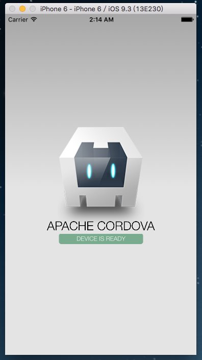
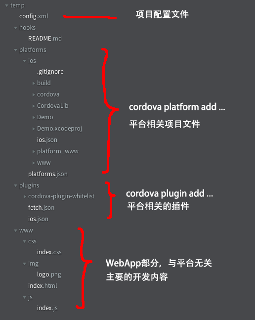
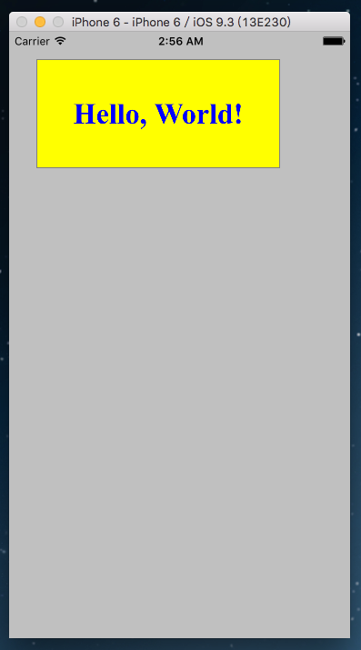
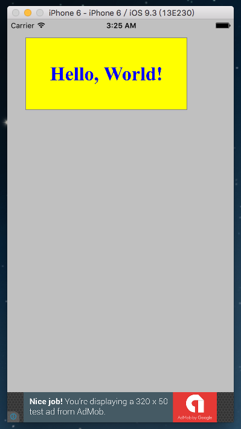

### 从编码到变现：程序员财务自由之路 （写作中）

### 目录

* [前言](#前言)
* [定位](#定位)
* [基础篇](#基础篇)
  * [语言与工具选择](#语言与工具选择)
  * [Hello, World!](#hello-world)
  * [单机版APP](#单机版APP)
  * [加个广告条](#加个广告条)
  * [注册广告账号](#注册广告账号)
  * [发布APP](#发布APP)
* [进阶篇](#进阶篇)
  * [需求是根本](#需求是根本)
  * [用户体验](#用户体验)
  * [哪家广告商最靠谱](#哪家广告商最靠谱)
  * [营销你的产品](#营销你的产品)
  * [联网版APP](#联网版APP)
  * [云服务](#云服务)
* [高级篇](#高级篇)
  * [数据分析](#数据分析)
  * [广告优化](#广告优化)
  * [支付与内购](#支付与内购)
  * [社交营销](#社交营销)
  * [广告投放](#广告投放)

### 前言

这篇文章（这本书），是写给程序员看的。

这并不是关于一门编程语言，也不是关于一种设计模式，更不是关于如何评估工程量、如何做项目管理。

即使你和我一样，掌握了若干种编程语言、用过数十种开发工具，积累了编程、架构、项目管理、带领研发团队、跨行业领域的经验。我相信，能够读到这方面的文章，也并不多见。

这篇文章（这本书）是关于，如何从编码，到实现赚钱。手把手，教你每一个步骤。

### 定位

既然是谈赚钱，像外包这种把有限的生命折算成manhour来卖钱的苦逼方式，我们暂不讨论。考虑到人力、时间、成本等因素，我们也暂时不讨论运营级、或者企业级的大型系统。

在移动互联网时代，以个人或者小团队，实现赚钱、甚至创造奇迹的故事，屡见不鲜。

例子1: 
[Flappy Bird](https://zh.wikipedia.org/wiki/Flappy_Bird) 传奇，一个花2-3天开发出来的小游戏，在短短几周时间席卷全球，并获得了每天 5 万美金的广告收益。这无疑有偶然、运气的成分，但至少这是有概率发生的事情。

例子2:
我认识一个波兰的老外，用做网页的技术，做了个并不复杂的计算器，大概也就是按照百分比计算下小费之类的。在欧洲好几个国家的应用商店上财务类APP，排名前几，通过广告条变现，赚了不少钱。

例子3:
（请自行谷歌、脑补）

我们要探讨的是，集中非常有限的时间、精力，聚焦到非常狭窄的需求领域，开发移动应用 APP、小游戏，发布到全球应用商店、获取用户、并实现盈利。

也许你是技术的大牛，掌握了数十种编程语言、设计模式、前端到后端的全栈开发能力。然而，并不是每项技术，都能够实现快速赚钱的。有时候，我们要做最容易扩展的架构。有时候，我们要选择最快速开发的技术手段。

也许你是刚入门的菜鸟，只会做做网页什么的。那也没有关系，赚钱真正需要的编程技术，其实也可以非常简单。只是有一点，需要什么知识，我们就恶补什么知识。由于技术日新月异，程序员必须是最善于学习的群体。

### 基础篇

### 语言与工具选择

开发 APP 的语言与工具，通常与平台密切相关。
* 如果是 iOS，那通常是 Objective C，开发工具是苹果推出的 [Xcode](https://developer.apple.com/xcode/) （开发工具仅运行于 Mac）。
* 如果是 Android，那通常是 Java，开发工具是 谷歌推出的 [Android Studio](http://developer.android.com/tools/studio/index.html)（开发工具有跨平台版本）。
* 如果是 Windows Phone，那就是 C#，开发工具是 微软推出的 [Visual Studio](https://www.visualstudio.com/en-us/visual-studio-homepage-vs.aspx)（开发工具仅运行于 Windows）。

除此之外，还有一些跨平台语言与工具，对于开发者更加友善，可以开发一次，多平台打包发布：
* 可以开发游戏与APP的 HTML5，以 javascript 作为主要的开发语言。
* 用于开发游戏的 [Cocos2d-X](http://www.cocos2d-x.org/)，用的是 C++ 作为主要的开发语言。
* 用于开发游戏的 [Unity3D](http://unity3d.com/) IDE 以及集成的 MonoDevelop，用的是 C# 作为主要的开发语言。
* 微软收购的 [Xamarin](https://www.xamarin.com/) 以及赞助的开源项目 [Mono](http://www.mono-project.com/)，用来开发 APP，以 C# 作为主要的开发语言。

在下文的教程中，我们选择最简单的 javascript 作为后续介绍的主要开发语言。实际上，它也是 github 上最为活跃的语言。它可以用来开发：
* 运行于浏览器内的 Web网页；
* 运行与内嵌浏览器的 单页WebApp；
* 基于 [nodejs](https://nodejs.org/) 的命令行工具；
* 基于 nodejs 的网络云服务；
* 基于 [cordova](http://cordova.apache.org/) 技术的，混合(hybrid) APP。
* 基于 [react-native](http://www.reactnative.com/) 开发 native UI体验的 APP。
* 甚至，也能够开发出桌面应用，例如 Adobe Brackets 代码编辑器。

因为它可以同时用来开发前端和后台，代码逻辑也可以用来前后端复用，从而降低技能门槛和开发成本。开发环境也要求非常低，只要有个友好的代码编辑器，有个浏览器可以用来运行和调试，就可以了。

以下是我个人用来做开发的环境和工具：
* Chrome浏览器，自带开发者工具 和 javascript 控制台，用来运行和调试。
* [Adobe Brackets](http://brackets.io/) 文本编辑器（如果你习惯 [Sublime Text](http://www.sublimetext.com/) 或者 [Atom](https://atom.io/) 或者 [Visual Studio Code](http://code.visualstudio.com/)，也没问题）
* iMac台式机，巨大的27寸屏幕，视野不受限制；Mac OS X命令行非常强大方便，通过 [MacPorts](https://www.macports.org/) 或者 [Homebrew](http://brew.sh/)，Linux 上有的命令行工具或者 library 都基本支持。
* Xcode（只有 Mac 版本），要调试 iOS APP，有台 iMac电脑或者 MacBook笔记本电脑，这也是必备的。
* Android Studio，用来调试 Android APP。

### Hello, World!

用 javascript 开发前端，其实需要的是 3 项相关的语言：HTML / javascript / CSS。
* HTML 负责内容
* javascript 负责逻辑
* CSS 负责渲染表现

以下是一个简单的例子：
```html
<!DOCTYPE html>
<!-- index.html -->
<html>
<head>
<meta charset="utf-8" />
<title>Hello</title>
<script type="text/javascript" src="main.js"></script>
<link rel="stylesheet" href="main.css"/>
</head>
<body>
<h1>Hello, World!</h1>
</body>
</html>
```
```javascript
// main.js
console.log('hello, world!');
```
```css
/* main.css */
body {
  width: 100%;
  height: 100%;
  padding: 0px;
  margin: 0px;
}
h1 {
  color: blue;
  padding: 40px;
  margin: 10px;
  border: 1px solid gray;
  display: inline-block;
}
```

用 Chrome 浏览器打开它，于是我们看到如下的展示：


* 上面的浏览器主窗口，显示了 HTML 的内容，并且用 CSS 指定的格式和效果进行了渲染。
* 下面打开 Chrome 的 console 窗口，则显示了 javascript 调用 console.log() 输出的调试信息。

用 HTML5 / javascript 做开发，入门就是这么简单。

如果需要开发出高质量的 APP，需要熟练掌握 HTML/CSS 和 javascript，尤其是 HTML5 / CSS3，掌握 HTML DOM 以及 javascript 的一些常见库，例如 [jQuery](https://jquery.com/)，等等。这里有一些免费的入门教程：
* [HTML 系列教程](http://www.w3school.com.cn/h.asp)
* [JavaScript 入门教程](http://www.w3school.com.cn/js/index.asp)
* [JavaScript 高级教程](http://www.w3school.com.cn/js/index_pro.asp)

通过这些教程的学习，你能够做到：
* 一个简单的 index.html 页面；
* 一个统一的 main.css 文件，能够对界面元素的表现加以控制和调整；
* 一组 javascript 文件，能够通过对 HTML DOM 的访问，实现内容的动态展示和切换。

对于作为程序员的你，这根本不是什么难的事情。

### 单机版APP

下一步，我们要把这样一个简单的网页程序 (web app)，变成一个手机上的 APP。准确的说，它应该是叫 Hybrid APP，即混合程序。因为它的外面是 native app 封装了一个 webview，里面运行的是 我们写的 web app。

我们需要用到 cordova 技术框架。它原来是 Adobe 公司收购的一个小团队开发的产品，重新命名为 [PhoneGap](http://phonegap.com/)，后来开源并捐赠给 Apache 基金会，然后被称为 [Apache Cordova](https://cordova.apache.org/)，现在称为一个非常流行的技术框架，也得到很多商业公司的追捧，除了 Adobe 之外，Intel、微软、IBM 等公司也都推出了支持 Cordova 的产品。

Cordova 技术框架提供了一个命令行的工具，是用 nodejs 开发的。

我们首先要装 [nodejs](https://nodejs.org/en/)，安装之后，会提供 2 个基本的命令：
```bash
$ which node
/usr/local/bin/node
$ node -v
v4.2.1
$ npm -v
2.14.7
```
* node --- 负责 javascript 程序的编译／解释／执行。它是基于谷歌开源的 Chrome V8 引擎的，基于事件驱动、不阻塞 IO模式运行，轻量而高效。
* npm --- NodeJs Package Manager, 安装包管理器。所有的 nodejs 包都是用 npm 来下载和安装，你也可以用它来发布你自己的包到 npm 库。（例如，我就把自己的一些作品发布在 npm 上：https://www.npmjs.com/~floatinghotpot）

接下来，用 npm 安装 [cordova](https://cordova.apache.org/)：
```bash
$ npm install -g cordova
$ which cordova
/usr/local/bin/cordova
$ cordova -v
5.4.1
```

用 cordova 创建一个项目：
```bash
# 格式为：cordova create <目录名> <APP ID> <APP名字>
$ cordova create temp com.rjfun.demo Demo
```

然后编译，并在 iOS 模拟器中运行这个项目：
```bash
$ cd temp
$ cordova platform add ios
$ cordova build ios
$ cordova emulate ios
```

于是可以看到 iOS 模拟器被启动，然后 APP 运行：



或者你也可以把 iPhone 用 USB 线连接到 Mac，然后用这个命令安装、启动刚刚编译的 APP：
```bash
$ cordova run ios --device
```

打开 Cordova 项目，可以看到这样的目录结构：



接下来，删去 www 目录下的内容，用我们前面写的 index.html, main.js, main.css 替换，并略作修改：
```html
<!DOCTYPE html>
<!-- index.html -->
<html>
<head>
  <meta charset="utf-8" />

  <!-- 下面的部分，是为了兼容移动设备的屏幕 -->
  <meta http-equiv="Content-Security-Policy" content="default-src 'self' data: gap: https://ssl.gstatic.com 'unsafe-eval'; style-src 'self' 'unsafe-inline'; media-src *">
  <meta name="format-detection" content="telephone=no">
  <meta name="msapplication-tap-highlight" content="no">
  <meta name="viewport" content="user-scalable=no, initial-scale=1, maximum-scale=1, minimum-scale=1, width=device-width">

  <!-- cordova 在 APP 编译打包时自动生成，用来初始化 cordova 框架代码 -->
  <script type="text/javascript" src="cordova.js"></script>

  <title>Hello</title>
  <script type="text/javascript" src="main.js"></script>
  <link rel="stylesheet" href="main.css"/>
</head>
<body>
<h1>Hello, World!</h1>
</body>
</html>
```

```javascript
// main.js
console.log('hello, world!');

// 当 APP 初始化完成，会触发 'deviceready' 事件，我们可以调用 cordova 框架以及插件提供的 API 和功能
document.addEventListener('deviceready', function(){
  console.log('deviceready');
  
  // TODO: 开始我们 web app 的业务逻辑
});
```

```css
/* main.css */
body {
  width: 100%;
  height: 100%;
  padding: 0px;
  margin: 0px;
  background-color: silver;
}
h1 {
  padding: 40px;
  margin: 30px;
  background-color: yellow;
  color: blue;
  border: 1px solid gray;
  display: inline-block;
}
```

重新运行 cordova 项目（会自动编译、安装、运行）：
```bash
$ cordova emulate ios
```

于是，可以看到 Web App 在 iOS 模拟器中运行了：



做个最简单的APP，其实也很简单，是不是？！

### 加个广告条

作为程序员，你可以通过掌握的 HTML/CSS 以及 javascript 编程能力，提供一些有趣、有用的功能。接下来，我们要给这个 APP 加上变现（monetization）的功能，即实现赚到真金白银（其实是美金）的功能。

变现最简单的方法，就是加上广告条，例如谷歌的AdMob。
* 通过展示广告，用户对有兴趣的广告点击，浏览产品、或者安装其他的 APP。
* 投放广告的人／公司（简称广告主，Advertizer）会支付广告费给谷歌。
* 而谷歌则会将其中的一小部分，支付给发布广告的人（简称发布商, Publisher）。
* 谷歌在其中扮演的角色，则称之为广告平台（Ad Platform）、或者广告中介（Ad Network）。

Cordova 框架的技术架构，是 Web APP 加上一些通用的插件，提供手机特定功能的访问、与第三方系统的集成。我们通过插件 cordova-plugin-admobpro 来实现与谷歌 AdMob 的集成。这是基于谷歌 AdMob SDK 开发的一个插件。通过它，可以用 javascript 代码来调用 SDK 提供的 API。

```bash
$ cordova plugin add cordova-plugin-admobpro
```

在 main.js 里面，在 APP 初始化完毕时，我们加几行代码。

```javascript
// main.js
console.log('hello, world!');

// 当 APP 初始化完成，会触发 'deviceready' 事件，我们可以调用 cordova 框架以及插件提供的 API 和功能
document.addEventListener('deviceready', function(){
  console.log('deviceready');
  
  // 在 APP 初始化完毕时，在屏幕下方创建一个广告条
  if(AdMob) AdMob.createBanner({
    adId: 'ca-app-pub-6869992474017983/4806197152', // 需要到 AdMob 官方网站注册用户，并创建广告单元 Ad Unit Id
    position: AdMob.AD_POSITION.BOTTOM_CENTER, // 展示在屏幕下方中央
    overlap: false, // 不要覆盖 Web APP 的内容
    isTesting: true, // 展示测试广告，在正式发布时，去掉这行
    autoShow: true // 广告资源就绪时，自动开始展示
  });
});
```

重新运行 cordova 项目（会自动编译、安装、运行）：
```bash
$ cordova emulate ios
```

于是，可以看到 Web App 在 iOS 模拟器中运行了：



看，下方的广告条展示出来了。

这里只是仅供调试用的测试广告。我们需要到 [AdMob官方网站](https://apps.admob.com/)注册用户，并创建广告单元 Ad Unit Id，并用来替换掉 代码中 adId 后面的这串数字。并在发布的正式版本中，去掉 `isTesting:true` 这行代码。

当用户在设备中下载、安装APP并运行的时候，就会从谷歌的广告服务器请求正式的广告内容，并用于展示了。每次用户对感兴趣的广告进行点击，就会产生广告收益。大部分的广告投放，是按照点击次数计算费用的，即所谓的 CPC 广告。

在计算广告收益的时候，有几个常见的基本术语：
* CPC（Cost Per Click，每次点击费用），大约是 US$ 0.06 ~ 1.0;
* CTR（Click Through Rate，展示点击率），大量统计的结果大约是 1%;
* CPM (Cost Per Mile, 每千次展示费用），通过 CPC 和 CPR 也能够推算出 CPM，大致范围是 US$ 0.5 ~ 5。

每次点击的价格，根据广告投放的价格不同而不同。全球不同国家由于经济水平不同，也存在很大的差异。例如，在美国，一次广告点击可能产生 1 美元的收益，在巴西，也许只有10 美分，相差 10~20 倍。

### 注册广告账号

上面的广告条，我们用了一个测试账号和一个测试专用的广告单元。要收到谷歌给你的广告分成，必须要注册一个AdMob账户，并创建相应的广告单元。下面我们就介绍，如何注册账号，如果创建广告单元，如何设置银行收款信息。


### 发布APP

### 进阶篇

### 需求是根本

### 用户体验

### 哪家广告商最靠谱

### 营销你的产品

### 联网版APP

### 云服务

### 高级篇

### 数据分析

### 广告优化

### 支付与内购

### 社交营销

### 广告投放
